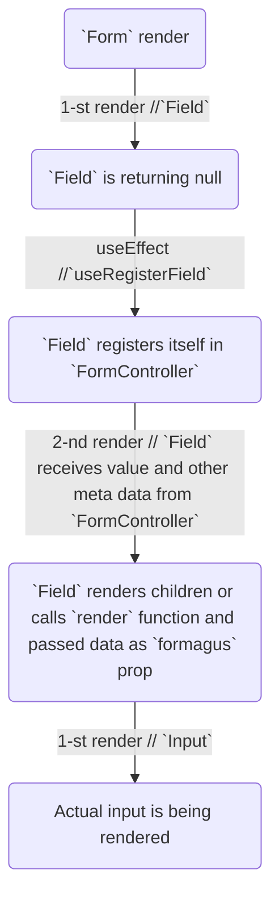

# Introduction

Formagus is your trusty helping wizard, that helps deal with forms. You don't have to worry about form and field states (dirty, touched, submit count, up to date values, errors and so on). Formagus is on the side of light magic, that won't hang
a noose over your neck, binding your to the structure of the form or components chosen by library and not you. It's completely indifferent to your html, no auto bindings and fighting with them. So to balance the scales you need to provide your own components, which are responsible for the displaying of form state.
Formagus doesn't have any built-in form components, but you can find examples of wiring in `Recipes` section.

Formagus is compatible with React 16+ and is powered by `Mobx`.

## What differs from other form libraries

* React way of structuring app, forms are made of dynamic elements.
 It was rendered - it becomes a part of form state and vice versa.
* is powered by Mobx and highly optimized, so it has great performance,
* You can use your own validation of any kind (eventually a lot of forms end up with home-baked solution well tailored for specific needs),
* support for field and form level validations (sync and async works out of the box)
* Imperative way to interact with the form, from any place in code, by creating new instance of form controller and then
 passing it as a prop
* simple, yet powerful form API, which allows you to model any form interactions (mobx `reaction`, `autorun`, etc.)
* written in typescript, fully typed
* `useField` allows you easily use `ANY` 3rd-party components or write your own, basically there is not difference in usage, you choose - you the boss!

## Basic concept

`<Form/>` injects all available props to your component by passing them to its child render function.
When you render `<Field/>` component with `name` prop (supports nesting like `name="someProps.nestedProp"`, and change the value to
`nestedPropValue` will result into having form values like `{someProps: {nestedProps: nestedPropValue}}`. `<Field/>` can
have children which will use `useField` hook, or `render` function callback, which will receive `<Field/>` state and render actual `<input />` or whichever element you want.
`useField` will return combined nearest `<Form/>` and `<Field/>` state.

## Step by step guide

Form without any blows and whistles looks like this:

```jsx
const onSubmit = ...implement me;

const SimpleAsHellForm = () => (
  <form onSubmit={onSubmit}>
    <input name="form_field_1" />
    <button type="submit">Submit</button>
  </form>
)
```

Now let's add the Formagus into the mix:

```jsx
import {Form} from 'formagus';

const onSubmit = (errors, values) => {
    if (errors === null) {
        fetch('www.endpoint.com', {
            method: 'POST',
            body: JSON.stringify(values),
        })
    }
};

const Formagus = () => (
  <Form onSubmit={onSubmit}>
    {({submit}) => {
      return (
       <form onSubmit={submit}>
          <input name="form_field_1" />
          <button type="submit">Submit</button>
       </form>
      )
    }}
  </Form>
)
```

Hm... Looks legit. But. It will not work. We missing the crucial player in the game – Mr. `Field`, which is the bridge
between Formagus and your displayed components. Field doesn't display anything by itself. In order to set it up, you need create
a component, that will render actual `<input/>` or any other component, which you want to wire up with form.
Now use `useField` hook, which will receive state of the `<Field/>`. Now, back to school:

```jsx
import {Form, Field, useField} from 'formagus';

const onSubmit = (errors, values) => {
    if (errors === null) {
        fetch('www.endpoint.com', {
            method: 'POST',
            body: JSON.stringify(values),
        })
    }
};

const Input = () => {
  const formagus = useField();
  return (
    <input
      value={formagus.value}
      onChange={(e) => {
        formagus.onChange(e.target.value);
      }}
    />
  )
}

const Formagus = (props) => (
  <Form onSubmit={props.onSubmit}>
    {({submit}) => {
      return (
       <form onSubmit={submit}>
          <Field name="form_field_1">
            <Input />
          </Field>
          <button type="submit">Submit</button>
       </form>
      )
    }}
  </Form>
)
```

Much better, now everything works. So, as you see, basic usage is pretty simple.

## Advanced usage

There are cases, when you need to interact with the form from outside of it. `createFormController` hurries to the rescue.

1. in any place in the code

```jsx
import {createFormController} from 'formagus';

const formController = createFormController({
  onSubmit: (errors, values) => {
    if (errors === null) {
      console.log(`Submitted values: ${values}`);
    } else {
      console.error(`Oops. Got some errors: ${errors}`);
    }
  }
});

export { formController }
```

2. later in React Component

```jsx
import * as React from 'react';
import {Form, Field} from 'formagus';
import {formController} from './formController';
import {Input} from './Input';

const Formagus = (props) => (
  <Form controller={formController}>
    {({submit}) => {
      return (
        <form onSubmit={submit}>
          <Field name="form_field_1">
            <Input />
          </Field>
          <button type="submit">Submit</button>
        </form>
      )
    }}
  </Form>
)
```

`FormController` receives the very same options, which can be passed to `Form` directly. If one passes `controller` prop,
then no other props should be passed to the `Form` and all the options should be passed to the created form controller instance.

## How it all works:

### Most simple form
```tsx
const Input = (props) => {
  const formagus = useField();
  return (
    <input
      value={formagus.value}
      onChange={(e) => {
        formagus.onChange(e.target.value);
      }}
    />
  )
}

<Form>
  {() => {
    <Field name="formagus_user">
      <Input />
    </Field>
  }}
</Form>
```

### Basic flow



