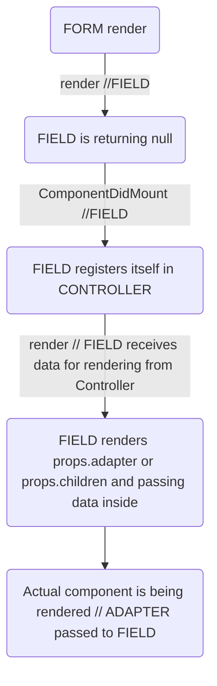

# Form

How it all works


## Available props:
<p class="category">look for type summary</p>

| prop          | signature | description |
| ------------- | --- | --- |
| onSubmit      | (errors: `FormValidationErrors`, values: `FormValues`, submitEvent?: React.FormEvent<any>) => void |
| initialValues | `FormValues` |
| onValidate    | (values: any) => `FormValidationErrors` |
| onFormat      | <T = Function>(values: `FormValues`) =>  {[P in keyof `FormValues`]: T[`FormValues`[P]]} |
| onSubmitAfter | (errors: `FormValidationErrors`, values: `FormValues`, submitEvent?: React.FormEvent<any>) => void |
| children      | (renderProps: `FormAPI`) => JSX.Element |
| controller * | `FormController`|


`*` - **controller** prop should be passed (instance of controller created manually before) OR any other props, but not both.


**type summary:**

```typescript
type EqualityCheckFunction = (newValue: any, oldValue: any) => boolean;

interface FormMeta {
  isValidating: boolean;
  isSubmitting: boolean;
  submitCount: number;
  isValid: boolean;
  isDirty: boolean;
  isTouched: boolean;
}

interface FormFieldMeta {
  custom: {[key: string]: any};
  onEqualityCheck: EqualityCheckFunction;
  initialValue: any;
  isTouched: boolean;
  isActive: boolean;
  isValidating: boolean;
  isDirty: boolean;
  isRegistered: boolean;
}

interface FormAPI {
  values: FormValues;
  errors: FormValidationErrors;
  submit: (submitEvent?: React.FormEvent<any>) => void;
  reset: () => void;
  clear: () => void;
  setFieldValue: (fieldName: string, value: any) => void;
  setFieldCustomState: (fieldName: string, key: string, value: any) => void;
  validate: () => void;
  getFieldMeta: (fieldName: string) => FormFieldMeta;
  meta: FormMeta;
}

type FormValues = {
  [key: string]: any | FormValues;
};

type Valid = null | undefined;
type Invalid = Omit<any, Valid>;
type FormValidationErrors = {[fieldName: string]: Invalid};
```
